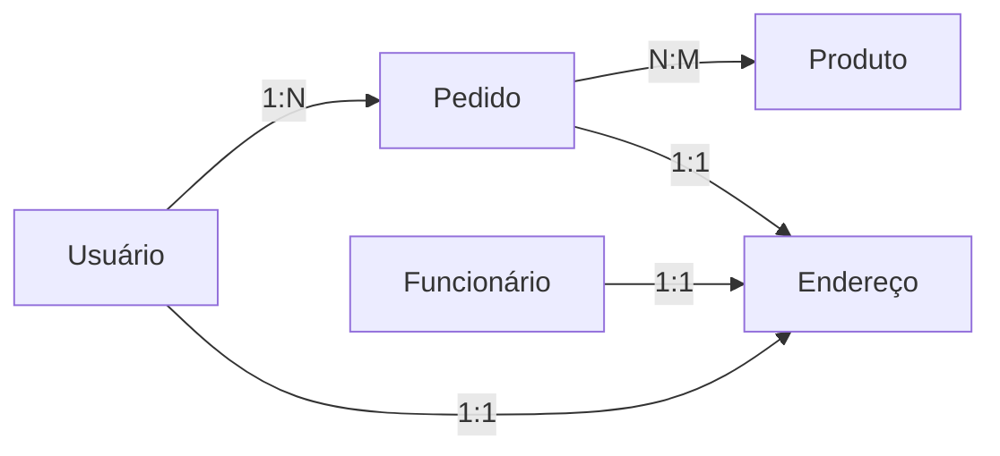

# 📊 Banco de Dados - Loja Revendedora de Bolsas

<p align="center">
  
  
</p>

---

## 📃 Descrição Geral do Projeto

Este projeto foi desenvolvido para simular um ambiente completo de banco de dados relacional para uma loja online de bolsas.  
O objetivo é proporcionar uma experiência educacional prática e teórica, explorando desde a modelagem conceitual até a execução de operações SQL avançadas.  
Todos os scripts, comandos e consultas foram pensados para demonstrar **boas práticas** de projeto, **segurança** dos dados e **otimização** de desempenho.

> **Contexto Acadêmico:**  
> Este repositório foi criado como atividade da Unidade Curricular Sistemas de Banco de Dados do curso de Desenvolvimento de Sistemas - Senai Petrópolis (2023).

---

## 🐘 Sobre o PostgreSQL

**PostgreSQL** é um sistema de gerenciamento de banco de dados relacional (SGBDR) robusto, gratuito e de código aberto, amplamente utilizado em projetos acadêmicos e profissionais.  
Alguns dos recursos destacados neste projeto:

- Tipos de dados personalizados (`ENUM`)
- Restrições de integridade (chaves primárias, estrangeiras, UNIQUE, CHECK, NOT NULL)
- Índices avançados (GIN e extensão `pg_trgm` para buscas textuais eficientes)
- Operações de relacionamento entre tabelas (`JOIN` múltiplos tipos)
- Comandos de análise e explicação de consultas (`EXPLAIN`, `ANALYZE`)
- Gerenciamento de permissões e usuários

> **Saiba mais:** [PostgreSQL Oficial](https://www.postgresql.org/)

---

## 🧩 Modelagem do Banco de Dados

### 🎯 Objetivos do Banco

- Gerenciar informações de usuários, funcionários, produtos, pedidos e endereços.
- Garantir integridade, segurança e flexibilidade dos dados.
- Permitir consultas analíticas e operacionais.
- Simular cenários reais, incluindo inserção, atualização, permissões e otimizações.

### 🗂️ Estrutura das Tabelas

| Tabela           | Função                                                                                      |
|------------------|--------------------------------------------------------------------------------------------|
| **usuario**      | Armazena dados dos clientes: nome, sobrenome, e-mail, senha, CPF, celular, apelido, etc.   |
| **funcionario**  | Armazena dados dos funcionários: nome, cargo, especializações, salários, endereço, etc.    |
| **produto**      | Cadastro de bolsas disponíveis para venda: nome, categoria, preço, cor, dimensões, estoque |
| **pedido**       | Registra pedidos realizados: descrição, cupom, frete, data, status, forma pagamento, etc.  |
| **pedido_produto** | Relaciona produtos e pedidos (N:M): quais produtos estão em cada pedido                  |
| **endereco**     | Endereços de usuários e funcionários: rua, bairro, cidade, estado, CEP, número, referência |

### 🔑 Restrições e Validações

- **Chaves Primárias**: garantem unicidade dos registros
- **Chaves Estrangeiras**: ligam tabelas e mantêm integridade referencial
- **UNIQUE**: impede duplicidade (ex: CPF, celular)
- **CHECK**: valida padrões (ex: formato do e-mail e CPF)
- **NOT NULL**: obriga informação nos campos essenciais

<details>
  <summary>Exemplo de restrição na tabela <code>usuario</code></summary>

```sql
CREATE TABLE usuario (
    usuario_id serial PRIMARY KEY,
    nome varchar(255) NOT NULL,
    email varchar(255) CHECK (email LIKE '%@%.com%') NOT NULL,
    CPF char(14) CHECK (CPF LIKE '%.%.%-%') UNIQUE NOT NULL,
    -- demais campos...
);
```
</details>

---

## 🔁 Tipos ENUM Personalizados

Para garantir maior integridade e clareza nos dados, criamos tipos ENUM específicos para campos com valores restritos.

| Tipo                   | Valores Permitidos                                                                                  |
|------------------------|----------------------------------------------------------------------------------------------------|
| `status_pedido_enum`   | 'Solicitação', 'Compra', 'Produção', 'Encaminhamento', 'Entrega'                                   |
| `forma_pagamento_enum` | 'Boleto', 'Cartão de Débito', 'Cartão de Crédito', 'Pix'                                          |
| `genero_enum`          | 'Mulher Cis', 'Homem Cis', 'Mulher Trans', 'Homem Trans', 'Outros', 'Não quero informar'          |
| `raca_enum`            | 'Amarela', 'Branca', 'Indígena', 'Parda', 'Preta', 'Não'                                          |
| `metodo_entrega_enum`  | 'Entrega', 'Retirada'                                                                              |

---

## 🔗 Diagrama Entidade-Relacionamento (ER)

Visualize as principais conexões entre as entidades do banco:



---

## 🛠️ Scripts de Criação e Povoamento

Os arquivos SQL deste projeto incluem:

- **Criação do banco de dados**
- **Criação dos tipos ENUM**
- **Definição das tabelas com suas restrições**
- **Inserção de dados em todas as tabelas (mínimo de 10 registros em cada)**
- **Exemplo de atualização de registros, incluindo campos `NULL`**
- **Criação de índices para otimização de consultas**
- **Comandos para gerenciamento de permissões e usuários**

### Exemplo de inserção:

```sql
INSERT INTO produto (nome, descricao, categoria, preco, cor, altura_cm, largura_cm, profundidade_cm, estoque, last_update)
VALUES
('Bolsa Baby Linho Natural', 'Bolsa em linho para uso diário...', 'Bolsa Baby', 95.00, 'Natural', 30.0, 40.0, 15.0, 10, NOW()),
-- demais produtos...
;
```

---

## 🔍 Consultas SQL Didáticas

Diversas consultas para explorar dados e aprender SQL, incluindo exemplos de JOINs, filtros, índices e análise de desempenho.

### Exemplos:

- **Listar todos os usuários**
    ```sql
    SELECT * FROM usuario;
    ```

- **Listar pedidos e respectivos usuários**
    ```sql
    SELECT u.usuario_id, u.nome, p.pedido_id, p.status, p.total
    FROM usuario u
    INNER JOIN pedido p ON u.usuario_id = p.usuario_id;
    ```

- **Consulta com filtro LIKE e índice**
    ```sql
    SELECT * FROM usuario WHERE nome LIKE '%i%';
    CREATE EXTENSION IF NOT EXISTS pg_trgm;
    CREATE INDEX idx_usuario_nome_trgm ON usuario USING gin (nome gin_trgm_ops);
    ```

- **EXPLAIN ANALYZE para medir desempenho**
    ```sql
    EXPLAIN ANALYZE SELECT * FROM usuario WHERE nome LIKE '%i%';
    ```

---

## 🔀 JOINs: Conectando Dados

Exploramos os três principais tipos de JOIN e seus efeitos nos resultados:

- **INNER JOIN:** apenas registros que têm correspondência nas duas tabelas
- **LEFT JOIN:** todos os registros da tabela à esquerda, mesmo sem correspondência na direita
- **RIGHT JOIN:** todos os registros da tabela à direita, mesmo sem correspondência na esquerda

```sql
-- INNER JOIN: Usuários e pedidos
SELECT u.nome, p.pedido_id
FROM usuario u
INNER JOIN pedido p ON u.usuario_id = p.usuario_id;

-- LEFT JOIN: Todos usuários, com ou sem pedidos
SELECT u.nome, p.pedido_id
FROM usuario u
LEFT JOIN pedido p ON u.usuario_id = p.usuario_id;

-- RIGHT JOIN: Todos pedidos, com ou sem usuários
SELECT u.nome, p.pedido_id
FROM usuario u
RIGHT JOIN pedido p ON u.usuario_id = p.usuario_id;
```

---

## 🏆 Operações Avançadas e Permissões

- **Alteração de tipos de colunas** (ex: `ALTER TABLE produto ALTER COLUMN cor TYPE int`)
- **Criação de usuários com diferentes níveis de permissões**
    - Usuário com privilégios totais (`GRANT ALL PRIVILEGES`)
    - Usuário com acesso apenas de leitura (`GRANT SELECT`)
- **Testes de restrições e erros gerados**
    - Tentativas de inserir ou alterar dados sem permissão
    - Erros ao tentar alterar tipos incompatíveis

---

## ⚙️ Como Executar o Projeto

1. **Clone o repositório:**
    ```bash
    git clone https://github.com/Nicolaspity/db_revenda_Nicolas.git
    ```

2. **Configure o ambiente PostgreSQL.**  
   Certifique-se de ter o PostgreSQL instalado e rodando.

3. **Execute os scripts SQL:**
    - Crie o banco de dados e execute os comandos do arquivo principal.
    - Importe os scripts de criação, povoamento e consultas no seu gerenciador preferido.

4. **Teste as consultas e operações:**
    - Experimente diferentes comandos para ver resultados, erros e efeitos de restrições e índices.

5. **Explore os arquivos e comentários para entender cada etapa do projeto.**

---

## 📚 Recomendações para Aprendizado

- **Altere os scripts e veja os resultados:** experimente modificar dados, restrições, índices e permissões.
- **Utilize EXPLAIN e ANALYZE:** avalie o impacto dos índices e otimize suas consultas.
- **Teste diferentes JOINs:** entenda as diferenças nos resultados e aplicações práticas.
- **Explore tipos ENUM:** crie campos mais seguros e claros.
- **Gerencie permissões:** aprenda como proteger seu banco de dados.

---

## 📝 Projeto acadêmico

> Este projeto simula um banco de dados completo para uma loja online de bolsas, como atividade da Unidade Curricular **Sistemas de Banco de Dados** do curso de Desenvolvimento de Sistemas (2023) - Senai Petrópolis.

---

<p align="center">
  
</p>

**Explore, aprenda, teste e contribua!**

---
